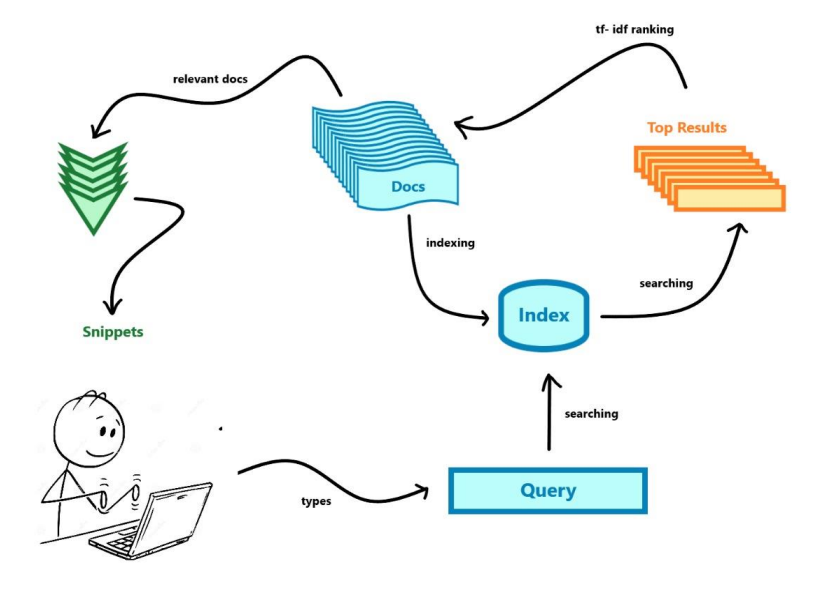
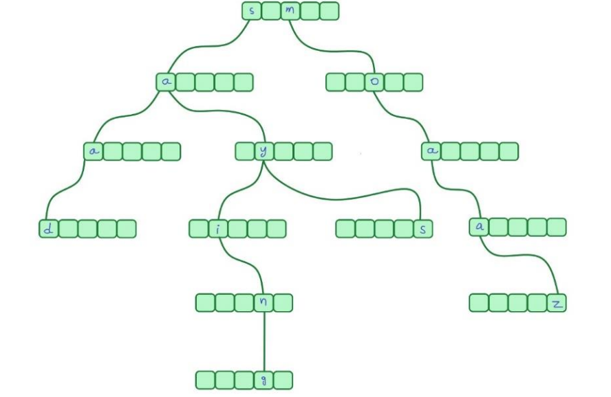
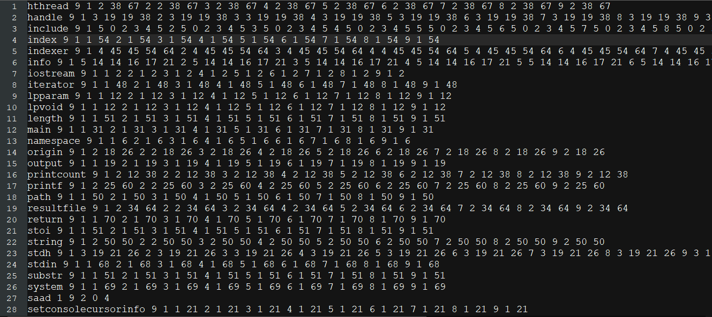
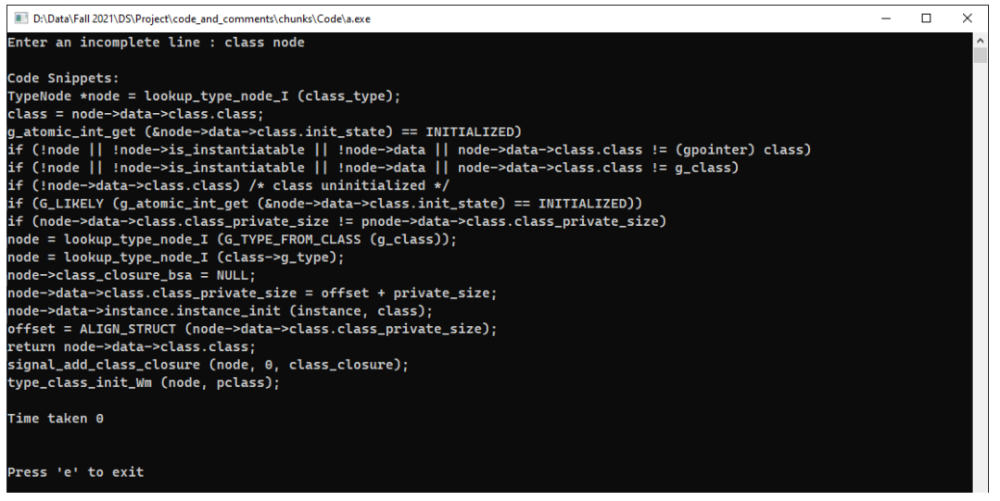
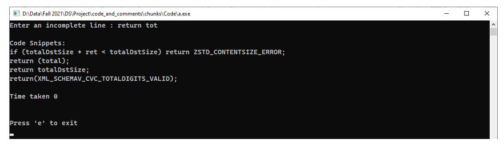
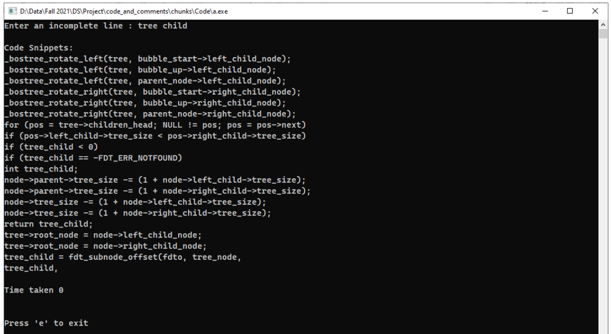

# ASM Copilot

An intelligent auto completion service which helps a 
programmer in autocompleting code snippets. While the
programmer is still typing, the pilot calculates what
the user is trying to type and suggests a set of most
relevant auto completion.

We design a simple analysis that extracts sequences of
keywords from a large codebase, and indexs them.
We then use an information retriveval technique to
find the highest ranked suggestions and use them
to synthesize a code completion.

## Dependencies

The project has used the windows api of threading.
Therefore, the project can only be compiled to windows machines 
that support this library. 

The version of GNU compiler should be atleast `9.0`
to support `C++17`. We have used the latest version to
find support for `<filesystem>` standard library.  

## Dataset

The dataset consists of sets of code snippets of
projects from different GitHub repositories. 
It was downloaded from https://zenodo.org/record/3472050#.YbNU1b1Bzcd.

> When using any dataset, make sure that the file names do not contain any extension.

## Working




## Indexing

We index all files into an inverted index
which is implemented through trie data structures.
After filtering the file from unnecessary tokens like 
comments and strings, the words are inserted into the trie
at the end of which lies a posting list which contains
information the like document count, document frequency,
number of lines of occurences in each document etc.


As mentioned above, we have used trie data structure
to store the tokens instead of a linked list. The reason 
is simple, tries have very low searching complexity. If
_n_ is the length of string to search, then the complexity
will be _O(n)_ .



After reading the corpus and forming an index, we write it
on a file to avoid indexing it again. The resulting file may look like:



## Information Retrieval

There are several techniques of information retrieval, 
from which we have adopted the __TF-IDF__ technique
which stands for _Term Frequency & Inverted Document Frequency_.

TF-IDF is a numerical score used in Information Retrieval systems, 
which can accurately represent the relevance of a search
term within a large corpus of documents. The idea is
that rarer words help narrow down the search more than 
common words, making those documents rank higher.
TF-IDF is currently the best known methodology for 
scoring the relevance of search terms in a set of 
documents


## Autocompletion

We ask the user to enter a line to autocomple and use the last two words only to compute a result.
The second last word is termed as the _context_, while the
last term is the _query_.
We first retrieve top relevant documents of both the
context and the query, then we rank those documents 
that contain both of these tokens.
Then we print only those lines in which both of these
words occur together, if possible. Otherwise, we display
only the lines containing the query.


## Screenshots








## Run Locally

Clone the project

```bash
  git clone https://github.com/saad0510/intelligent-autocompletion
```

Go to the project directory

```bash
  cd intelligent-autocompletion
```

Copy your dataset in the `dataset/` directory. Make sure
that there is no extension with the filenames.

Compile and run the `main_index.cpp` file which will index
your dataset and write it on `index.txt` file.

```bash
    g++ main_index.cpp -o indexer.exe
    ./indexer.exe
```

Finally, compile and run the `main.cpp` file which
will read the `index.txt` and ask you for a code
line and display the results.

```bash
    g++ main.cpp -o main.exe
    ./main.exe
```


## Documentation

For a detailed explanation of everything, refer to this [report.](./Report.pdf).

## Last Updated

December, 2021

## Authors

- github : [@saad0510](https://www.github.com/saad0510)
- email  : k200161@nu.edu.pk or ayyansaad46@gmail.com

